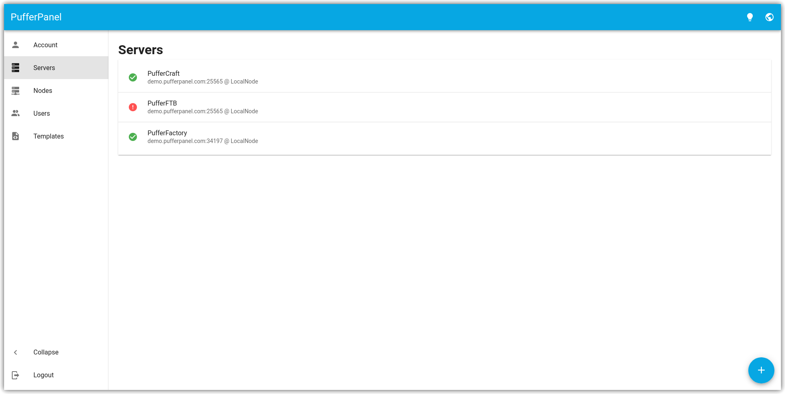

<!--
Важно: этот README был автоматически сгенерирован <https://github.com/YunoHost/apps/tree/master/tools/readme_generator>
Он НЕ ДОЛЖЕН редактироваться вручную.
-->

# PufferPanel для YunoHost

[](https://ci-apps.yunohost.org/ci/apps/pufferpanel/)


[](https://install-app.yunohost.org/?app=pufferpanel)

*[Прочтите этот README на других языках.](./ALL_README.md)*

> *Этот пакет позволяет Вам установить PufferPanel быстро и просто на YunoHost-сервер.*  
> *Если у Вас нет YunoHost, пожалуйста, посмотрите [инструкцию](https://yunohost.org/install), чтобы узнать, как установить его.*

## Обзор

PufferPanel is a web-based Game Server Management System created by players for players. PufferPanel allows you to run multiple different game servers all from one central location, and give other users their own servers, or access to your own servers.


**Поставляемая версия:** 2.7.1~ynh1

## Снимки экрана



## Документация и ресурсы

- Официальный веб-сайт приложения: <https://www.pufferpanel.com/>
- Официальная документация администратора: <https://docs.pufferpanel.com/en/latest/>
- Репозиторий кода главной ветки приложения: <https://github.com/PufferPanel/PufferPanel>
- Магазин YunoHost: <https://apps.yunohost.org/app/pufferpanel>
- Сообщите об ошибке: <https://github.com/YunoHost-Apps/pufferpanel_ynh/issues>

## Информация для разработчиков

Пришлите Ваш запрос на слияние в [ветку `testing`](https://github.com/YunoHost-Apps/pufferpanel_ynh/tree/testing).

Чтобы попробовать ветку `testing`, пожалуйста, сделайте что-то вроде этого:

```bash
sudo yunohost app install https://github.com/YunoHost-Apps/pufferpanel_ynh/tree/testing --debug
или
sudo yunohost app upgrade pufferpanel -u https://github.com/YunoHost-Apps/pufferpanel_ynh/tree/testing --debug
```

**Больше информации о пакетировании приложений:** <https://yunohost.org/packaging_apps>
